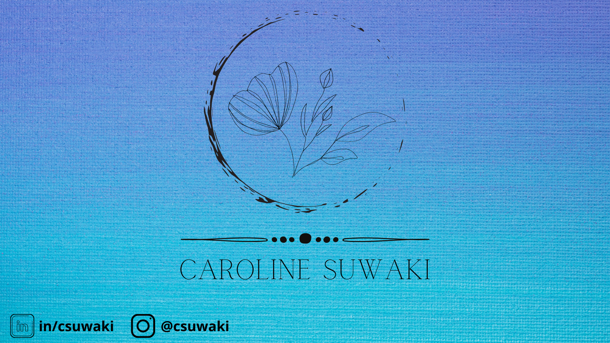

### Hi there, welcome to my profile. :sunny:

 

Hello! My name is Caroline, I am an Oceanographer from Sao Paulo, Brazil. :ocean: I am currently pursuing my Master's degree in Biological Oceanography at University of Sao Paulo. I consider myself a curious person who loves to enjoy life. Riding my bike, travelling, taking pics, listening to some nice music, enjoying nature, studying about technology and spending time with friends are on the top of my list of favorite habits! 

I’m currently learning Python. :snake:

Pronouns: she/her. :girl:

 
### Get in touch:

&nbsp;&nbsp;
&nbsp;&nbsp;
&nbsp;&nbsp;

